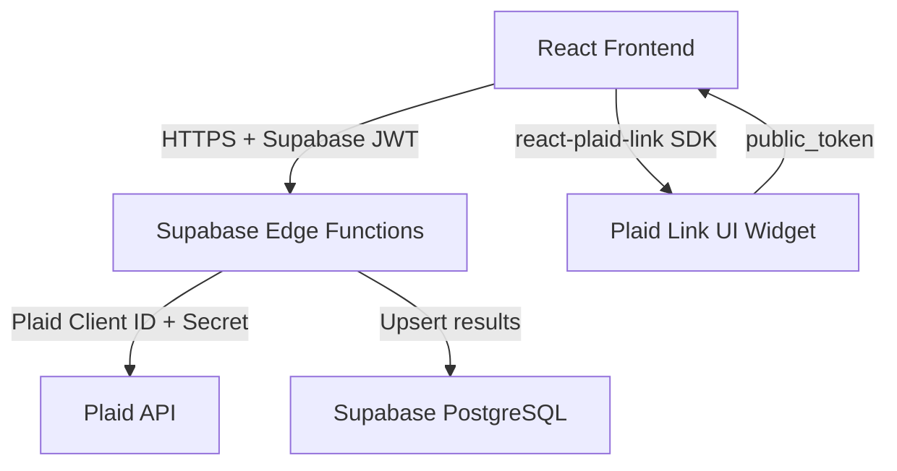
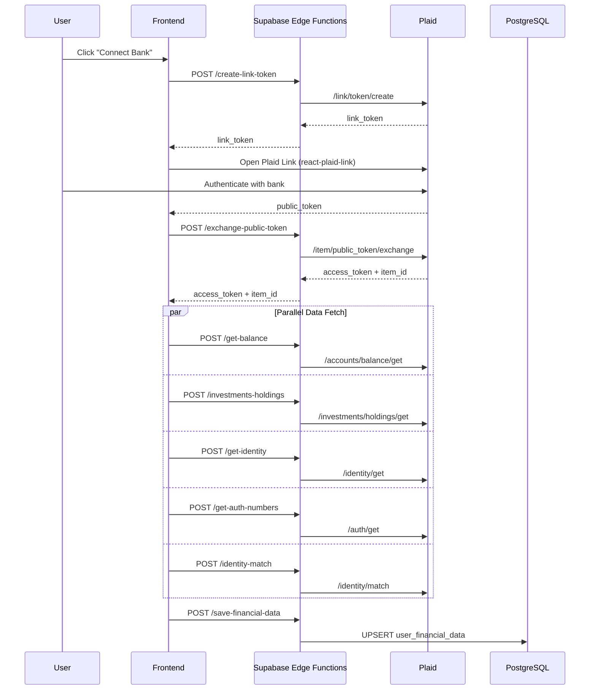

# Plaid Implementation Audit

> **Date**: August 3, 2026  
> **Scope**: Full audit of the Plaid financial verification integration  
> **Answer**: We use **Supabase Edge Functions** as the backend layer. Plaid APIs are called **server-side** from Edge Functions. The frontend **never** calls Plaid directly.

---

## Architecture

**Key point**: Plaid secrets live only in Edge Function environment variables. The frontend holds zero secrets.

---

## Data Flow

---

## File Inventory

### Frontend (Client-Side)

| File | Role |
|------|------|
| `src/services/plaid/plaidService.ts` | HTTP client — calls Supabase Edge Functions. No direct Plaid API calls. |
| `src/services/plaid/usePlaidLink.ts` | React hook — uses `react-plaid-link` SDK, orchestrates the full flow |
| `src/components/kyc/screens/KycFinancialLinkScreen.tsx` | UI — renders accounts, holdings, identity data, product status |
| `src/pages/onboarding/FinancialLink.tsx` | Page wrapper — auth check, loads existing data |
| `src/pages/onboarding/financial-link/logic.ts` | Business logic hook — wraps `usePlaidLinkHook`, derives UI state |
| `src/pages/onboarding/financial-link/ui.tsx` | Presentation component (refactored) |
| `src/pages/onboarding/Step7.tsx` | Legacy step — redirects to `/onboarding/financial-link` |

### Backend (Supabase Edge Functions)

| Edge Function | Plaid API Endpoint | Purpose |
|---|---|---|
| `create-link-token/` | `/link/token/create` | Creates a Plaid Link token |
| `exchange-public-token/` | `/item/public_token/exchange` | Exchanges public token for access_token + item_id |
| `get-balance/` | `/accounts/balance/get` | Fetches account balances |
| `get-identity/` | `/identity/get` | Fetches bank-verified identity |
| `get-auth-numbers/` | `/auth/get` | Fetches ACH/routing numbers |
| `identity-match/` | `/identity/match` | Scores identity match vs bank records |
| `investments-holdings/` | `/investments/holdings/get` | Fetches investment holdings + securities |
| `asset-report-create/` | `/asset_report/create` + `/get` | Creates and polls asset reports |
| `save-financial-data/` | _(none — DB only)_ | Upserts data to `user_financial_data` |
| `signal-prepare/` | `/signal/prepare` | Prepares transaction signal |
| `signal-evaluate/` | `/signal/evaluate` | Evaluates transaction signal risk |
| `signal-decision-report/` | `/signal/decision/report` | Reports signal decision |
| `signal-return-report/` | `/signal/return/report` | Reports signal return |

### Database

| Table | Key Columns |
|---|---|
| `user_financial_data` | `user_id`, `plaid_item_id`, `plaid_access_token`, `institution_name`, `institution_id`, `balances`, `asset_report`, `asset_report_token`, `investments`, `available_products`, `identity_data`, `auth_numbers`, `identity_match`, `status`, `fetch_errors` |

### Migrations

| Migration | Purpose |
|---|---|
| `20260214173600_create_user_financial_data.sql` | Creates `user_financial_data` table |
| `20260216_add_plaid_access_token.sql` | Adds `plaid_access_token` column |
| `20260222000000_add_identity_columns.sql` | Adds `identity_data` column |
| `20260222100000_add_signal_prepared_column.sql` | Adds signal-related column |
| `20260222200000_add_auth_and_identity_match_columns.sql` | Adds `auth_numbers` + `identity_match` |

### Tests

| File | Type |
|---|---|
| `tests/plaidIntegration.test.ts` | Unit tests — mocked fetch against Edge Functions |
| `tests/plaidSandboxLive.test.ts` | Live sandbox tests — calls real Plaid Sandbox API (skipped without env vars) |

### Config

| Item | Details |
|---|---|
| `.env.local.example` | `PLAID_CLIENT_ID_SANDBOX`, `PLAID_SECRET_SANDBOX`, `PLAID_CLIENT_ID_PRODUCTION`, `PLAID_SECRET_PRODUCTION`, `PLAID_ENV` |
| `package.json` | Dependency: `react-plaid-link` (frontend SDK only, no `plaid-node`) |

---

## Security Assessment

| Aspect | Status | Notes |
|---|---|---|
| Plaid secrets exposure | OK | Secrets stored only in Edge Function env vars |
| Access token storage | Review | `plaid_access_token` in DB — verify RLS restricts to `auth.uid() = user_id` |
| Auth on Edge Functions | OK | Functions receive Supabase JWT via `Authorization: Bearer` header |
| No direct Plaid calls from frontend | OK | All calls go through Edge Functions |
| Plaid SDK on frontend | OK | Only `react-plaid-link` (Link UI widget) |

---

## Concerns and Recommendations

### 1. Access Token Round-Trip

The `exchange-public-token` Edge Function returns `access_token` to the frontend, which passes it back to other Edge Functions. Consider keeping the access token server-side only — store in DB after exchange, then have Edge Functions retrieve it by `user_id`.

### 2. RLS Policies

Verify that Row Level Security on `user_financial_data` ensures users can only read/write their own rows. The migration enables RLS but confirm the policies are tight.

### 3. No Official Plaid SDK on Backend

Edge Functions use raw `fetch()` instead of `plaid-node`. This works but skips SDK-level validation, type safety, and automatic retries.

### 4. Sandbox vs Production

`PLAID_ENV` defaults to `sandbox`. Verify production deployments switch to production credentials and the `https://production.plaid.com` base URL.

### 5. Asset Report Polling

`asset-report-create` creates a report and polls for completion. Verify there is a timeout or max-retry limit to avoid Edge Function timeouts.

### 6. Live Test Credentials

`plaidSandboxLive.test.ts` calls Plaid APIs directly. Ensure sandbox credentials used in tests are not committed or leaked.

---

## Summary

The Plaid integration uses a **clean, secure architecture**:

- **Frontend**: `react-plaid-link` for the bank connection UI + `plaidService.ts` as an HTTP client to Supabase Edge Functions
- **Backend**: 12 Supabase Edge Functions that hold Plaid secrets and call Plaid APIs server-side via `fetch()`
- **Storage**: `user_financial_data` table in Supabase PostgreSQL with RLS enabled
- **Main improvement**: Keep `access_token` entirely server-side instead of round-tripping through the frontend
